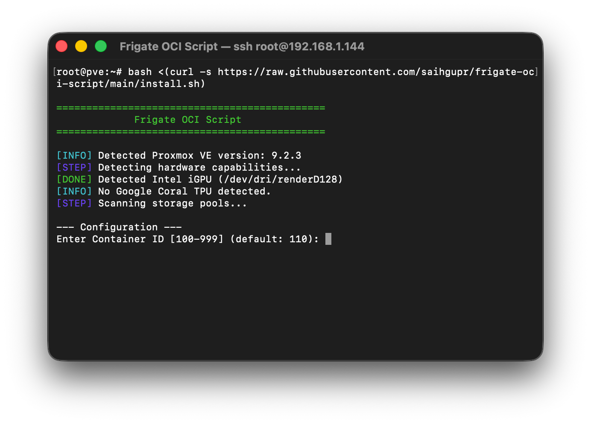
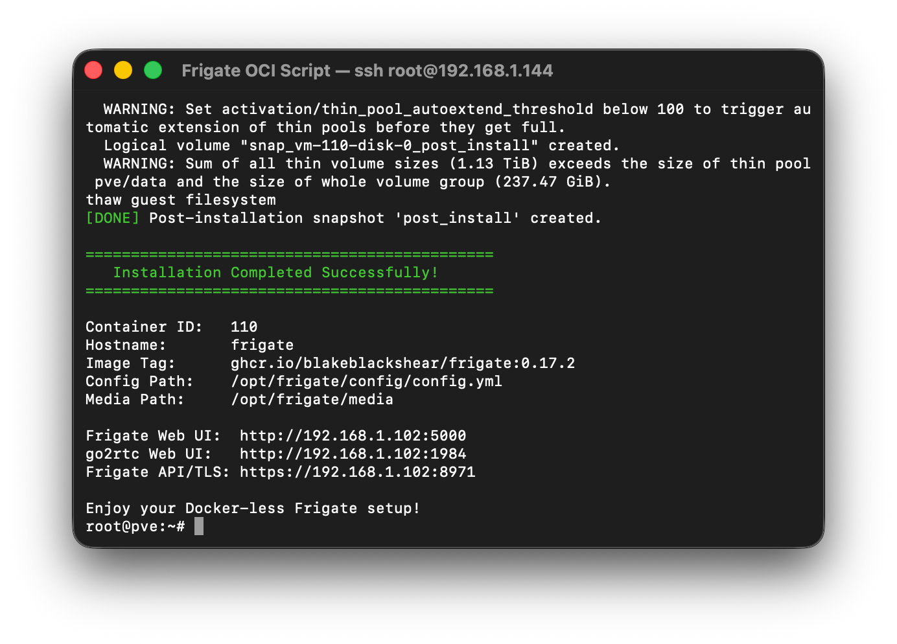
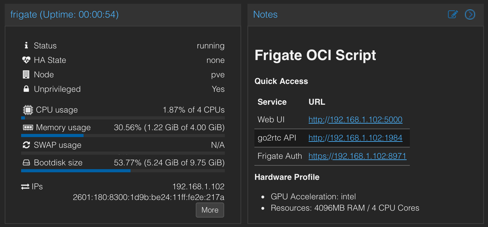

# Frigate OCI Script

A lightweight, fully automated command-line utility to deploy and manage [Frigate NVR](https://frigate.video/) on Proxmox VE 9.1+ using **native OCI container templates**. 

This script eliminates the resource overhead and nesting requirements of running Docker-in-LXC by creating an LXC container directly from the official Frigate OCI image.







## Features

* **Zero Docker Overhead**: Boots the Frigate OCI image natively as a lightweight unprivileged LXC container.
* **Unprivileged by Default**: Stronger isolation and security compared to privileged Docker-in-LXC stacks.
* **Hardware Acceleration**: Automatic configuration of Intel iGPU, AMD, or Nvidia GPUs using Proxmox 8.2+ `dev[n]` mappings.
* **Google Coral Support**: Seamless passthrough for both PCIe Coral (Apex) and USB Coral TPUs.
* **WebRTC Fix via In-Container s6 Service**: Automatically provisions an `s6-overlay` oneshot service inside the container that disables IPv6 and brings up the loopback interface before `go2rtc` starts, avoiding the IPv6 Duplicate Address Detection race that breaks WebRTC live view on boot. Because the fix lives inside the container filesystem (not a host-side Proxmox hookscript), it survives cluster node-to-node migrations.
* **State Persistence**: Mounts host directories for configuration and media files, ensuring no data loss when container is recreated.
* **Seamless Upgrades**: An intelligent `update.sh` script that automates container teardown, pulls the new OCI template, and recreates the container while restoring all environment variables, resources, and hardware passthrough configurations.

---

## Requirements

* **Proxmox VE 9.1** or newer (required for stable native OCI container image pull/template support).
* Root privileges on the Proxmox host.
* Configured storage that supports **Container Templates (vztmpl)** (e.g., `local`).

---

## Quick Start

## 1. Installation

To install Frigate, execute the following command on your Proxmox host shell:

```bash
bash <(curl -s https://raw.githubusercontent.com/saihgupr/frigate-oci-script/main/install.sh)
```

Alternatively, download and run the script manually:

```bash
wget https://raw.githubusercontent.com/saihgupr/frigate-oci-script/main/install.sh
bash install.sh
```

#### Command-line Options

When running the installer manually, you can pass parameters to customize or automate the installation:

| Flag | Description | Example |
| :--- | :--- | :--- |
| `-y`, `--yes`, `--silent`, `--non-interactive` | Run in non-interactive mode (auto-applies defaults) | `bash install.sh -y` |
| `-d`, `--dry-run` | Run in dry-run mode (simulates changes without executing them) | `bash install.sh -d` |
| `--id <CTID>` | Specify the target Container ID (100–999) | `bash install.sh --id 999` |
| `--hostname <name>` | Specify the container hostname | `bash install.sh --hostname frigate` |
| `--mount <host>:<guest>` | Configure a custom external storage bind mount | `bash install.sh --mount /mnt/data:/opt/storage` |

#### What the installer does:
1. Prompts for container ID, hostname, CPU/RAM, and target storage.
2. Invokes the Proxmox API (`oci-registry-pull`) to download and cache the OCI image.
3. Automatically sets up the container configuration with `--ostype unmanaged`.
4. Creates host storage directories and configures bind mounts (`/config` and `/media/frigate`).
5. Automates hardware and TPU passthroughs in `/etc/pve/lxc/<CTID>.conf`.

### 2. Updating Frigate

To update Frigate, run:

```bash
bash <(curl -s https://raw.githubusercontent.com/saihgupr/frigate-oci-script/main/update.sh) -i <CTID> -v <version>
```

Alternatively, download and run the script manually:

```bash
wget https://raw.githubusercontent.com/saihgupr/frigate-oci-script/main/update.sh
bash update.sh -i <CTID> -v <version>
```

#### Command-line Options

The updater script supports the following options:

| Flag | Description | Example |
| :--- | :--- | :--- |
| `-i`, `--id`, `--container` | **Required.** The ID of the container to update | `bash update.sh -i 109` |
| `-v`, `--version` | The target Frigate version tag to pull (use 'latest' or omit to auto-fetch) | `bash update.sh -v latest` |
| `-t`, `--template-storage` | The storage pool to download the OCI template to (default: `local`) | `bash update.sh -t local` |
| `-d`, `--dry-run` | Run in dry-run mode (simulates upgrade without making changes) | `bash update.sh -d -i 109 -v latest` |

#### What the updater does:
1. Stops the container (if it was running) and takes a safety configuration snapshot.
2. Creates a temporary helper container from the newly pulled OCI template version.
3. Mounts both filesystems and syncs the root filesystem from the new template to the active container using `rsync` (automatically preserving custom mount points, configuration, media directories, and all existing Proxmox snapshots).
4. Synchronizes and updates the OCI container's entrypoint settings.
5. Cleans up by destroying the temporary helper container.
6. Restarts the updated container (if it was running) and updates the Proxmox summary dashboard notes.

---

## Troubleshooting & Tips

### Console Access
OCI containers do not run a standard systemd init system or getty console. If the built-in Proxmox console is blank or unresponsive, log into the Proxmox host shell and run:

```bash
pct enter <CTID>
```
This drops you directly into a bash session inside the container.

### Config File
The Frigate configuration file is located on the Proxmox host at `/opt/frigate/config/config.yml` (or your chosen host bind-mount path). You can edit this file on the host using `nano` or upload your configuration directly. Once edited, restart the container via:

```bash
pct restart <CTID>
```

### WebRTC & go2rtc Configuration
Because native OCI containers run behind virtual network namespaces without full host network bridging:
1. `go2rtc` needs to listen on `0.0.0.0` (all interfaces) rather than just `127.0.0.1` so Home Assistant and the Web UI can connect to it.
2. WebRTC peer negotiation requires telling the client browser exactly what IP address/port the container is listening on (since it cannot automatically detect its external bridge IP).

Ensure the `go2rtc` section in your `config.yml` matches this structure:

```yaml
go2rtc:
  streams:
    your_camera:
      - rtsp://192.168.1.188:8554/1080p # Replace with your actual camera source

  api:
    listen: "0.0.0.0:1984"              # Required: allows Home Assistant to reach go2rtc API
  rtsp:
    listen: "0.0.0.0:8554"              # Required: allows external players to pull RTSP streams
  webrtc:
    listen: "0.0.0.0:8555"              # Required: enables WebRTC UDP streaming
    candidates:
      - <LXC_STATIC_IP>:8555            # Required: Replace with your container IP (e.g. 192.168.1.204:8555)
```

---

## Support & Feedback

If you encounter any issues or have feature requests, please open an [issue on GitHub](https://github.com/saihgupr/frigate-oci-script/issues).

If you find it useful, consider giving it a star ⭐ or [making a donation](https://ko-fi.com/saihgupr) to support development.


